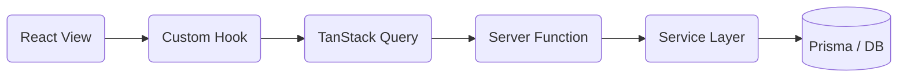

# Start-Basic 架构文档

> 本文档旨在详细说明项目的核心架构、技术选型和开发规范，为开发者提供清晰的指导。

---

## 1. 技术栈概述

项目基于现代化的全栈框架与工具构建，注重类型安全与开发效率。

- **核心框架**: [TanStack Start](https://tanstack.com/start) (基于 TanStack Router 的全栈 React 框架)
- **UI 框架**: React 19 + [Tailwind CSS v4](https://tailwindcss.com/)
- **组件库**: [Radix UI](https://www.radix-ui.com/) + [shadcn/ui](https://ui.shadcn.com/)
- **路由管理**: TanStack Router (全类型安全地文件化路由)
- **认证与授权**: [Better Auth](https://www.better-auth.com/) + RBAC (角色权限控制)
- **数据流**: [TanStack Query](https://tanstack.com/query) (React Query)
- **ORM**: [Prisma](https://www.prisma.io/) 7 + PostgreSQL（driver adapter: `@prisma/adapter-pg`）
- **多语言**: [i18next](https://www.i18next.com/) (支持数据库运行时动态加载翻译)

---

## 2. 目录结构

项目采用 **模块化 (Module-based)** 的组织方式，核心业务逻辑按功能边界垂直拆分。

```text
src/
├── routes/             # 路由定义 (TanStack Router 约定)
│   ├── __root.tsx      # 根路由 (Provider 注入 + beforeLoad 检查)
│   ├── _authenticated/    # 认证保护路由组
│   │   ├── admin/      # 管理后台路由 (需 admin/superadmin 角色)
│   │   └── ...
│   ├── (auth)/ (public)/ (errors)/   # 公共与错误页
│   ├── api/            # HTTP 端点 (仅少量；业务主要走 Server Functions)
│   └── m/              # 移动端路由
├── modules/            # 核心业务模块
│   └── <module>/
│       ├── module.ts   # 模块契约 (defineModule: key / dependencies / exports)
│       ├── features/   # 具体功能区 (页面级)
│       └── shared/     # 模块内共享服务、Server Functions、Hooks
├── components/         # 全局共享组件
│   └── ui/             # shadcn 原始位
├── shared/             # 全局共享资源
│   ├── lib/            # db, auth-client, env, query-keys 等
│   ├── hooks/          # 通用 React Hooks
│   ├── context/        # 核心上下文 (Theme, Auth, Locale)
│   └── utils/          # 纯函数工具类
├── infrastructure/     # 运行时配置、数据库连接、可观测性 (不属任何业务模块)
├── core/               # 模块体系内核 (module-registry, event-bus)
├── i18n/               # 国际化配置
└── styles/             # 全局样式配置
```

### 2.1 模块契约

每个业务模块通过 `module.ts` 声明自身边界，并在 `src/modules/index.ts` 注册：

```ts
export const paymentModule = defineModule({
  key: 'payment',
  version: '1.0.0',
  dependencies: ['auth'],
  exports: { services: {...}, events: {...} },
})
```

`src/modules/module-boundaries.test.ts` 静态扫描各模块 `shared/` 目录，跨模块 import 未声明在 `dependencies` 中即测试失败。**未注册的模块不受此约束**——新增模块务必注册。

### 2.2 数据层

- Prisma schema 由 `db/prisma/schema/*.part` 分片合并生成（`pnpm db:merge` → `db/prisma/schema.prisma`，该文件已 gitignore）。
- 生效的迁移目录是 `db/prisma/migrations_pg/`；`db/prisma/migrations/` 为早期 SQLite 残留，**不要在其新增迁移**。
- 客户端单例在 `src/infrastructure/db/prisma-client.ts`，通过 `getDb()`（异步）或 `getDbSync()` 获取。

---

## 3. 核心设计模式

### 3.1 模块模式 (Module Pattern)
每个业务模块（如 `admin`）是自包含的：
- **features/**: 页面级别的功能组件。
- **shared/services/**: 纯业务逻辑层，直接与 Prisma/Database 交互（仅服务端）。
- **shared/server-fns/**: TanStack Start 的 Server Functions，作为 API 的代理层。
- **shared/hooks/**: 模块特有的数据获取 hooks (通常封装 `useQuery`)。

### 3.2 统一的 Query Keys
所有 TanStack Query 的 Key 均在 `src/shared/lib/query-keys.ts` 中集中管理。
- **规范**: `[category, ...specifics]` 数组格式。
- **层次化**: 
  - `['admin', 'users', 'list', params]`
  - `['rbac', 'roles', 'detail', id]`
这种结构允许我们通过 `queryClient.invalidateQueries({ queryKey: ['admin', 'users'] })` 批量精准失效缓存。

### 3.3 鉴权与中间件
安全层由两部分组成：
1. **客户端检查**: 通过 `useAuth` hook 或路由的 `beforeLoad` 进行重定向。
2. **服务端保护**: `withAuth` 和 `withAdminAuth` 中间件封装。
   - 记录详尽的 **审计日志 (Audit Log)** 和 **系统日志 (System Log)**。
   - 验证 Session 和角色权限（RBAC）。

---

## 4. 数据流向


```mermaid
graph LR
    View(React View) --> Hook(Custom Hook)
    Hook --> Query(TanStack Query)
    Query --> ServerFn(Server Function)
    ServerFn --> Service(Service Layer)
    Service --> Database[(Prisma / DB)]
```

- **读操作**: View -> Hook -> useQuery -> ServerFn (GET) -> Service -> DB
- **写操作**: View -> useMutation -> ServerFn (POST) -> Service -> DB -> Invalidate Key

---

## 5. 开发规范

- **命名**: 
  - 组件: PascalCase (如 `UserTable`)
  - 文件/文件夹: kebab-case (如 `user-service.ts`)
- **副作用**: 尽可能在 Server Functions 中处理业务副作用，保持组件纯净。
- **类型**: 必须使用各层的契约类型，通过 Zod 校验 Server Function 的输入输出。

---

## 6. 国际化 (i18n)

项目使用双重翻译机制：
1. **本地 JSON**: 基础 UI 文档 (如 `src/modules/admin/shared/locales`)。
2. **数据库翻译**: `Translation` 模型支持管理员在后台动态修改文案，应用启动后会异步加载并覆盖本地配置。

---

## 7. 已知技术债与演进计划

完整评审见 [架构评审报告](ARCHITECTURE-REVIEW-2026-09.md)。当前重点：

1. **`modules/admin` 正在拆分**：它承载了身份、组织、权限、导航、系统配置五个子域，是全部业务代码的主体。目标是把五个子域提升为平级模块，`admin` 退化为壳（layout + 菜单编排 + 路由聚合）。**新功能不要再放进 `modules/admin/features/`。**
2. **模块契约未全覆盖**：目前只注册了 auth / payment / health / audit / navigation 五个模块，其余模块尚未纳入边界约束，需补齐 `module.ts` 并注册。
3. **鉴权中间件待合并**：`src/middleware.ts` 的 `withAuth` / `withAdminAuth` 存在重复实现，计划收敛为 `withSession({ roles })` 工厂，并区分 401（未登录）与 403（无权限）。
4. **前端包体待优化**：首屏 chunk 偏大，计划引入 `manualChunks` 与路由级动态导入。
